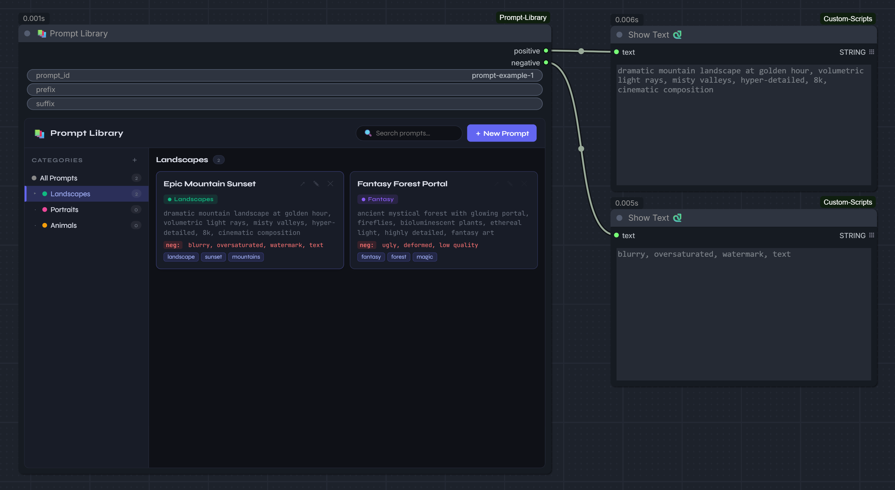

# 📚 Prompt Library — ComfyUI Custom Node

A fully-featured prompt manager integrated directly into ComfyUI.
Organize, search, and reuse your AI generation prompts with categories, sub-categories, tags, and negative prompts.
Includes a dedicated **Random Prompt** node for automatic prompt variation on every workflow run.




---

## ✨ Features

| Feature | Details |
|---|---|
| 📁 **Categories** | Unlimited nesting (categories → sub-categories → …) |
| 🎨 **Color coding** | Each category gets its own color |
| 🔍 **Search** | Full-text search across titles, prompt text, and tags |
| 🏷️ **Tags** | Comma-separated tags on every prompt |
| ➖ **Negative prompts** | Store positive + negative together |
| ↗ **One-click use** | Instantly loads the selected prompt into the node |
| ✎ **Edit in place** | Modal editors for prompts and categories |
| 🎲 **Random mode** | Separate node that picks a random prompt from selected categories at every run |
| 🌱 **Seed control** | Fixed seed for reproducible results, `-1` for true randomness |
| 🔀 **Random segments** | Support for `{abc|xyz|123}` syntax (supports nesting) |
| 💾 **Auto-persist** | All data saved to `prompt_library_data.json` |

---

### 🔡 String Concatenate

A utility node that concatenates multiple string inputs with a custom delimiter. The number of inputs can be adjusted dynamically, and a live preview of the result is shown on the node.

| Input | Description |
|---|---|
| `delimiter` | The string used to join the inputs (e.g., ", ", " ", "\n") |
| `input_count` | How many string inputs to show (2 to 20) |
| `string1-N` | Dynamic string inputs (can be connected from other nodes) |

Returns a single concatenated `STRING`.

## 🚀 Installation

1. Clone this repo into your ComfyUI custom nodes directory:

```bash
git clone https://github.com/florestefano1975/ComfyUI-Prompt-Library
```

2. Restart ComfyUI.

3. Both nodes are available under **Add Node → utils/prompts**:
   - **📚 Prompt Library** — browse and manually select a prompt
   - **🎲 Prompt Library — Random** — pick a random prompt from selected categories

---

## 📚 Node 1 — Prompt Library (manual)

Browse your library, search, manage categories, and load any prompt with one click.

### Outputs

| Output | Description |
|---|---|
| `positive` | The saved positive prompt text (+ optional prefix/suffix) |
| `negative` | The saved negative prompt text |

### Inputs

| Input | Description |
|---|---|
| `prompt_ids` | Auto-filled when you click a card in the UI |
| `prompts` | Human-readable list of selected prompt titles |
| `seed` | `-1` = truly random on every run · any other value = reproducible result (for random segments `{a|b}`) |
| `prefix` *(optional)* | Text prepended to the positive prompt |
| `suffix` *(optional)* | Text appended to the positive prompt |

---

## 🎲 Node 2 — Prompt Library Random

Picks a **random prompt** from one or more selected categories every time the workflow runs.

### UI

- **Left column** — category tree with checkboxes. Tick any category (including parent categories, which include all their children in the pool). Badges show how many categories are selected and the total number of eligible prompts.
- **Select all / Clear** — quick bulk selection.
- **Right column** — live preview of all prompts currently in the pool, with their category color indicator.

The selection is stored in the `category_ids` widget and persists with the saved workflow.

### Inputs

| Input | Description |
|---|---|
| `category_ids` | Comma-separated category IDs (managed automatically by the UI) |
| `seed` | `-1` = truly random on every run · any other value = reproducible result |
| `prefix` *(optional)* | Text prepended to the extracted prompt |
| `suffix` *(optional)* | Text appended to the extracted prompt |

### Outputs

| Output | Description |
|---|---|
| `positive` | prefix + extracted prompt text + suffix |
| `negative` | Negative prompt of the extracted prompt |
| `prompt_title` | Title of the extracted prompt (useful for logging/display) |
| `prompt_id` | ID of the extracted prompt |

---

## 📂 Data file

All prompts and categories are stored in `prompt_library_data.json` in the node folder.
You can back it up, version-control it, or share it between machines.

---

## 🛠 Internal REST API

| Method | Path | Description |
|---|---|---|
| GET | `/prompt_library/data` | Load full library |
| POST | `/prompt_library/data` | Replace full library |
| POST | `/prompt_library/category` | Create category |
| PUT | `/prompt_library/category/:id` | Update category |
| DELETE | `/prompt_library/category/:id` | Delete category + all children + their prompts |
| POST | `/prompt_library/prompt` | Create prompt |
| PUT | `/prompt_library/prompt/:id` | Update prompt |
| DELETE | `/prompt_library/prompt/:id` | Delete prompt |

---

## 📝 Changelog

### v1.3
- 🎲 Added **Prompt Library Random** node (`PromptLibraryRandomNode`)
- Random node outputs `prompt_title` and `prompt_id` in addition to `positive` / `negative`
- Seed support: `-1` for true randomness, fixed integer for reproducibility

### v1.2
- Fixed search input losing focus on every keystroke (partial DOM re-render)
- `prefix` and `suffix` changed to single-line inputs (`multiline: False`)
- Fixed library panel overflowing outside node bounds (flex `min-height: 0` fix)

### v1.1
- Initial release with browse node, category tree, search, tags, modals
